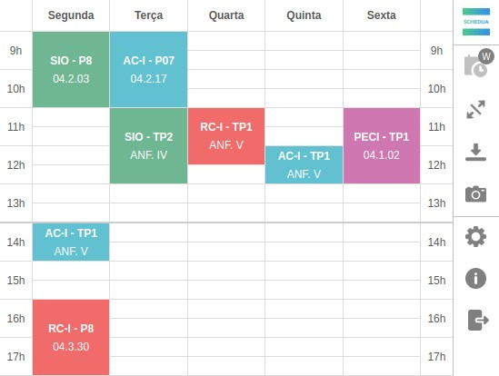
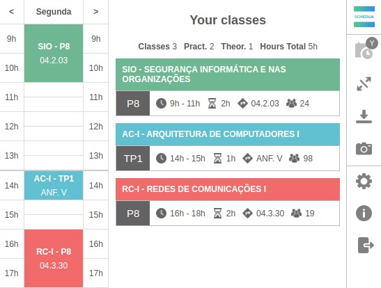

  
  

## Vê o teu horário da Universidade de Aveiro no browser!

### Schedua - Browser Extension

<a href="https://chrome.google.com/webstore/detail/schedua/hdidghpdffhhefdafcajajjocjbmbnml">
  

    
    
  

</a>
  

  
  &nbsp;
  <a href="https://github.com/digas99/schedule-ua">
    <picture>
      <source media="(prefers-color-scheme: dark)" srcset="images/github-mark-white.png">
      
    </picture>
  </a>

## Projects for University Subjects:

- [ASE (Arquiteturas para Sistemas Embutidos)](https://github.com/digas99/ase-project)
- [AAD (Arquiteturas de Alto Desempenho)](https://github.com/digas99/aad-projects)
- [CM (Comunicações Móveis)](https://github.com/digas99/cm-project-wlan2)
- [AS (Análise de Sistemas)](https://github.com/digas99/as-project)
- [IIA (Introdução à Inteligência Artificial)](https://github.com/digas99/iia-project-sokoban)
- [RC I (Redes de Comunicações I)](https://github.com/digas99/rc1-project)
- [SIO (Segurança Informática e nas Organizações)](https://github.com/digas99/sio-project-1)
- [LFA (Liguagens Formais e Autómatos)](https://github.com/digas99/lfa-project-geometrics)
- [MPEI (Métodos Probabilísticos para Engenharia Informática)](https://github.com/digas99/mpei-project-library-management)

## Exercises for University Subjects:

- [LFA (Liguagens Formais e Autómatos)](https://github.com/digas99/lfa-exercicios)
- [AC II (Arquitetura de Computadores II)](https://github.com/digas99/ac2-exercicios)
- [AC I (Arquitetura de Computadores I)](https://github.com/digas99/ac1-exercicios)

Diogo Costa Correia - Student at Universidade de Aveiro

<!--
**digas99/digas99** is a ✨ _special_ ✨ repository because its `README.md` (this file) appears on your GitHub profile.

Here are some ideas to get you started:

- 🔭 I’m currently working on ...
- 🌱 I’m currently learning ...
- 👯 I’m looking to collaborate on ...
- 🤔 I’m looking for help with ...
- 💬 Ask me about ...
- 📫 How to reach me: ...
- 😄 Pronouns: ...
- ⚡ Fun fact: ...
-->
